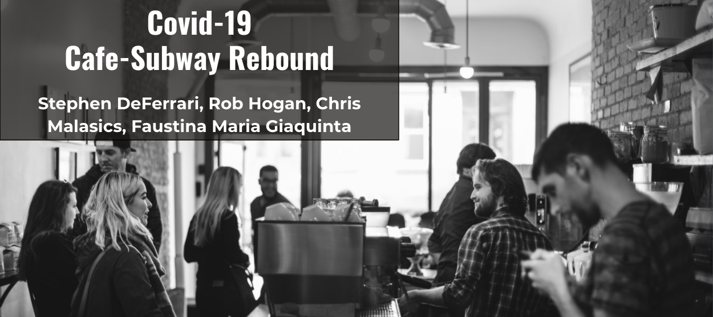

# MTA-COVID-Rebound

**EDA project correlating subway traffic with cafe revenue, making the case for a decrease in commercial property rent for bussinesses located near subway stops still dormant due to Covid-19.**

In this repo you will find the following files:
* The [powerpoint presentation](https://github.com/S-DeFerrari/MTA-COVID-Rebound/blob/master/Covid_Rebound.pdf) on this project going over each step of the process as well as the results. This is the best place to start.
* The jupyter notebook used for [working on the MTA subway data.](https://github.com/S-DeFerrari/MTA-COVID-Rebound/blob/master/Bedford%20Ave%20-%20Entries%20vs.%20Date.ipynb)
* The jupyter notebook used for [working on the Cafe Beit sales data.](https://github.com/S-DeFerrari/MTA-COVID-Rebound/blob/master/Beit%20Code.ipynb)

The data is a combination of turnstile data gathered from the MTA's [website](http://web.mta.info/developers/turnstile.html) and sales data supplied by Cafe Beit. 
